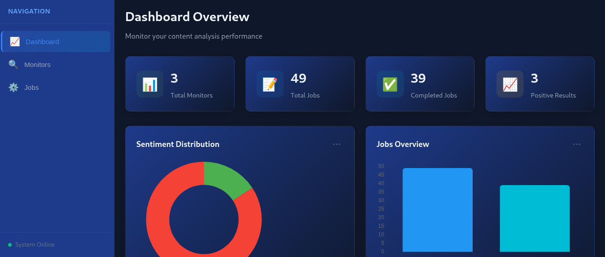
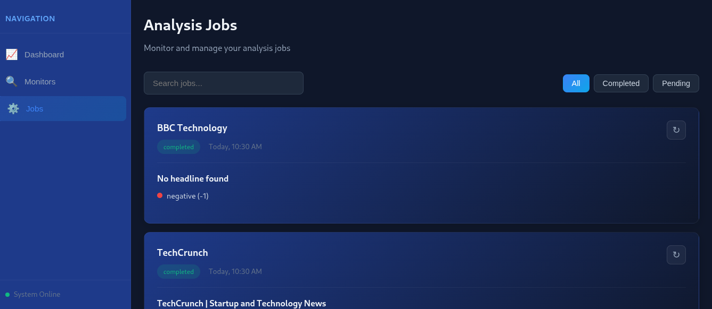
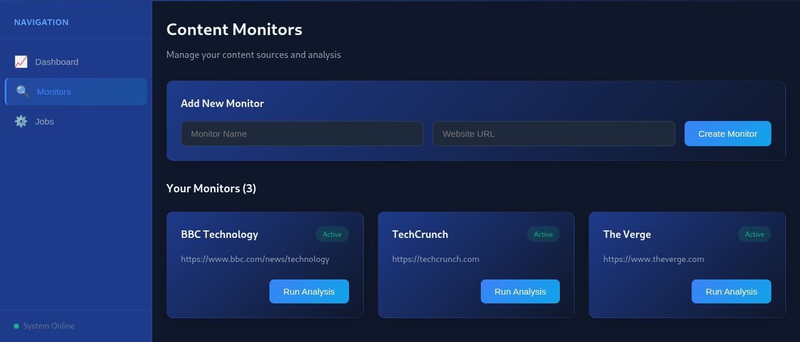

 Scrape → Transform → Notify Framework

A modular Python-based automation framework that scrapes data from websites, transforms it into useful insights, and provides a real-time monitoring dashboard with job scheduling.

Features

* 🌐 **Web Scraping** – Collects structured data from websites.
* 🔄 **Data Transformation** – Cleans and processes raw data into meaningful reports.
* 📊 **Dashboard** – Visualizes collected data and metrics in real-time.
* ⏲️ **Job Scheduler** – Automates scraping tasks (daily/hourly).
* 📡 **Monitoring** – Tracks scraping activity, job status, and performance.

🛠Tech Stack

* **Python** (BeautifulSoup / Requests / Playwright)
* **Pandas** (data cleaning & transformation)
* **Flask / FastAPI** (dashboard & monitoring UI)
* **SQLite / PostgreSQL** (data storage)
* **APScheduler / Celery** (job scheduling & monitoring)

 How It Works

1. Define target URLs and scraping rules.
2. Framework scrapes raw data.
3. Data gets cleaned and transformed automatically.
4. Results are displayed in the **Dashboard**.
5. Jobs are scheduled and monitored in the **Job Manager**.

 Demo Screenshots

 Dashboard – Real-time Data Visualization

Job Scheduler – Task Automation

Monitor – Status & Activity Logs

